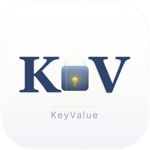

<p align="center">
  
</p>

<h1 align="center">KeyValue</h1>

<p align="center">
  <strong>K🔒V — Secure Password & Key-Value Manager for macOS</strong>
</p>

<p align="center">
  <a href="https://github.com/aresnasa/mac-keyvalue/releases/latest"></a>
  <a href="https://github.com/aresnasa/mac-keyvalue/blob/main/LICENSE"></a>
  <a href="https://github.com/aresnasa/mac-keyvalue/releases"></a>
  
  
</p>

<p align="center">
  Encrypted Storage · Hotkey Typing · Clipboard Management · Gist Sync
</p>

<p align="center">
  <a href="README_zhCN.md">🇨🇳 中文文档</a>
</p>

---

## 📦 Installation

### Option 1: Homebrew (Recommended)

```bash
brew tap aresnasa/tap
brew install --cask keyvalue
```

### Option 2: Download DMG

1. Go to [Releases](https://github.com/aresnasa/mac-keyvalue/releases/latest) and download the latest `.dmg`
2. Open the DMG and drag **KeyValue.app** into the **Applications** folder
3. First launch: **Right-click** KeyValue.app → select **Open**

> ⚠️ This is a free, open-source app with ad-hoc signing. macOS will warn "the developer cannot be verified" on first launch — right-click → Open to bypass.
> Alternatively run: `xattr -cr /Applications/KeyValue.app`

### Option 3: Build from Source

```bash
git clone https://github.com/aresnasa/mac-keyvalue.git
cd mac-keyvalue/MacKeyValue

# Build and run
./build.sh --run

# Or build a DMG installer
./build.sh --dmg
```

<details>
<summary>Build script usage</summary>

```bash
./build.sh              # Build Release .app
./build.sh debug        # Build Debug .app
./build.sh --run        # Build + launch
./build.sh --dmg        # Build + package DMG
./build.sh --dmg --run  # Build + DMG + launch
./build.sh --icons      # Regenerate app icons only
./build.sh --clean      # Remove all build artifacts
./build.sh --help       # Full help
```

</details>

---

## 🚀 Getting Started

### First-Launch Permissions

On first launch the app will guide you through granting two system permissions:

| Permission | Purpose | Settings Path |
|---|---|---|
| **Accessibility** | Simulate keyboard input for passwords | System Settings → Privacy & Security → Accessibility |
| **Input Monitoring** | Create keyboard events | System Settings → Privacy & Security → Input Monitoring |

Enable both toggles for KeyValue, then restart the app as prompted.

### Basic Usage

1. **Add an entry** — Click the `+` button or press `⌘N` to create a new key-value entry. Choose a category (Password, Code Snippet, Command, etc.), fill in the title, key, and value, then save.

2. **Copy a value** — Select an entry and press `⇧⌘C`, or hover and click the copy icon. The value is decrypted, copied to the clipboard, and automatically cleared after 120 seconds.

3. **Paste to a target window** — Press `⇧⌘V` on an entry. The app hides itself, gives you 3 seconds to click the target input field, then simulates `⌘V` into the frontmost application.

4. **Type into a password field** — Press `⇧⌘T` on an entry. This types the value character-by-character via simulated keystrokes — perfect for **PVE/KVM web consoles**, **noVNC**, and any field that blocks paste.

5. **Global hotkeys** — Bind any entry to a global hotkey in **Settings → Hotkeys**. Press the hotkey from anywhere to instantly type the password into the currently focused window.

### Default Keyboard Shortcuts

<table>
<tr>
<th width="260" align="center">Shortcut</th>
<th align="left">Action</th>
</tr>
<tr>
<td align="center"><kbd>&nbsp;⌘&nbsp;</kbd>&ensp;<kbd>&nbsp;⇧&nbsp;</kbd>&ensp;<kbd>&nbsp;K&nbsp;</kbd></td>
<td>&emsp;🪟&ensp; Show / Hide main window</td>
</tr>
<tr>
<td align="center"><kbd>&nbsp;⌘&nbsp;</kbd>&ensp;<kbd>&nbsp;⌥&nbsp;</kbd>&ensp;<kbd>&nbsp;Space&nbsp;</kbd></td>
<td>&emsp;🔍&ensp; Quick search</td>
</tr>
<tr>
<td align="center"><kbd>&nbsp;⌘&nbsp;</kbd>&ensp;<kbd>&nbsp;⇧&nbsp;</kbd>&ensp;<kbd>&nbsp;V&nbsp;</kbd></td>
<td>&emsp;📋&ensp; Clipboard history</td>
</tr>
<tr>
<td align="center"><kbd>&nbsp;⌘&nbsp;</kbd>&ensp;<kbd>&nbsp;⇧&nbsp;</kbd>&ensp;<kbd>&nbsp;⌥&nbsp;</kbd>&ensp;<kbd>&nbsp;P&nbsp;</kbd></td>
<td>&emsp;🔒&ensp; Toggle privacy mode</td>
</tr>
<tr>
<td align="center"><kbd>&nbsp;⌘&nbsp;</kbd>&ensp;<kbd>&nbsp;1&nbsp;</kbd></td>
<td>&emsp;🔄&ensp; Switch between Compact / Full mode</td>
</tr>
</table>

### Two UI Modes

- **Compact mode** (default) — A slim, searchable list with hover action buttons (Copy / Paste / Type). Optimized for quick lookups.
- **Full mode** — A 3-column management interface with filtering, sorting, detailed views, and entry editing. Toggle with `⌘1`.

---

## ✨ Features

### 🔐 AES-256 Encrypted Storage

- **AES-256-GCM** authenticated encryption (tamper-proof)
- Master key stored in the macOS **Keychain**
- Key rotation and HKDF-SHA256 key derivation
- Random nonce per encryption operation

### ⌨️ Hotkeys & Keyboard Simulation

- Global hotkeys to copy or type passwords with a single keystroke
- **Simulated keyboard character-by-character typing** — bypasses paste-blocking password fields (PVE/KVM web consoles, noVNC, remote desktops)
- Automatic **⌘V paste** into the target window
- Custom hotkey bindings per entry

### 📋 Smart Clipboard

- Automatic clipboard history (up to 500 entries)
- Smart content-type detection (text, URLs, file paths, …)
- Source application tracking
- Pin important clipboard items
- Auto-clear clipboard after copying passwords

### ☁️ GitHub Gist Sync

- Bi-directional sync with GitHub Gist
- Timestamp-based automatic conflict resolution
- Token stored securely in Keychain
- **Encrypted values and private entries are never uploaded**

### 🔒 Privacy Mode

- Clipboard operations are not recorded
- All data stored 100% locally
- Private entries excluded from sync

### 🗂️ Entry Management

- Categories: Password / Code Snippet / Command / Clipboard / Other
- Tags, favorites, and full-text search (regex supported: `/pattern/`)
- Usage statistics and sorting
- JSON import / export
- Compact mode & Full management mode

---

## 🏗️ Architecture

```
MacKeyValue/
├── Package.swift                    # Swift Package Manager
├── build.sh                         # Build & packaging script
├── Sources/
│   ├── App/
│   │   └── MacKeyValueApp.swift     # Entry point, menu bar, AppDelegate
│   ├── Models/
│   │   └── KeyValueEntry.swift      # Data model
│   ├── Services/
│   │   ├── EncryptionService.swift  # AES-256-GCM encryption
│   │   ├── StorageService.swift     # Local persistence
│   │   ├── ClipboardService.swift   # Clipboard & keyboard simulation
│   │   ├── HotkeyService.swift      # Global hotkeys (Carbon)
│   │   ├── GistSyncService.swift    # Gist sync
│   │   └── BiometricService.swift   # Touch ID authentication
│   ├── ViewModels/
│   │   └── AppViewModel.swift       # MVVM view model
│   └── Views/
│       ├── ContentView.swift        # Main interface
│       ├── CompactView.swift        # Compact mode
│       └── AccessibilityGuideOverlay.swift  # Permission guide
├── Resources/
│   ├── Info.plist
│   ├── MacKeyValue.entitlements
│   ├── AppIcon.icns
│   └── Assets.xcassets/
└── Tests/
```

### Design Patterns

- **MVVM** + Service Layer
- **Combine** for reactive data flow
- **async/await** for asynchronous operations
- **@MainActor** for UI thread safety
- **CGEvent**-based keyboard simulation with lazy-init CGEventSource

---

## 🔒 Security Architecture

```
User data → JSON encoding → AES-256-GCM encryption → Local file
                                     ↑
                              Master key (256-bit)
                                     ↑
                           macOS Keychain (hardware-protected)
```

- All sensitive data encrypted with AES-256-GCM authenticated encryption
- Master key protected by the macOS Keychain (accessible when device is unlocked)
- 12-byte random nonce per encryption via `SecRandomCopyBytes`
- Gist sync only transmits metadata — **encrypted values never leave the device**

---

## 📦 Dependencies

| Package | Purpose |
|---|---|
| [swift-crypto](https://github.com/apple/swift-crypto) | AES-GCM encryption, HKDF key derivation |
| [KeyboardShortcuts](https://github.com/sindresorhus/KeyboardShortcuts) | Global hotkeys |
| [SwiftSoup](https://github.com/scinfu/SwiftSoup) | HTML content parsing |

---

## 🛠️ Development

### Requirements

- **macOS 13.0+** (Ventura or later)
- **Xcode 15.0+** or **Swift 5.9+**

### Quick Start

```bash
cd MacKeyValue

# Build & run with SPM
swift run MacKeyValue

# Or open in Xcode
open Package.swift
```

### Release

The release script automates the full cycle: build DMG → git tag → GitHub Release → Homebrew tap update.

```bash
./scripts/release.sh 1.2.0              # Release v1.2.0
./scripts/release.sh 1.2.0 --dry-run    # Preview without publishing
./scripts/release.sh 1.2.0 --skip-brew  # Skip Homebrew update
```

Prerequisites: `gh` CLI authenticated (`gh auth login`).

---

## ☕ Support

If KeyValue is useful to you:

- ⭐ **Star** this project on GitHub
- 🐛 File an [Issue](https://github.com/aresnasa/mac-keyvalue/issues) for bugs or feature requests
- 🔀 Submit a [Pull Request](https://github.com/aresnasa/mac-keyvalue/pulls)
- ☕ Buy me a coffee by scanning a QR code below

### Donate / 赞赏

<p align="center">
  
  &nbsp;&nbsp;&nbsp;&nbsp;&nbsp;&nbsp;
  
  <br/>
  <sub>微信扫码赞赏 &nbsp;&nbsp;&nbsp;&nbsp;&nbsp;&nbsp;&nbsp;&nbsp;&nbsp;&nbsp;&nbsp;&nbsp;&nbsp;&nbsp;&nbsp;&nbsp;&nbsp;&nbsp;&nbsp;&nbsp; 支付宝扫码转账</sub>
</p>

> Every Star ⭐ and piece of feedback keeps development going!

---

## 📄 License

[MIT License](LICENSE) — free to use, modify, and distribute.

---

<p align="center">
  <sub>Made with ❤️ by <a href="https://github.com/aresnasa">aresnasa</a></sub>
</p>